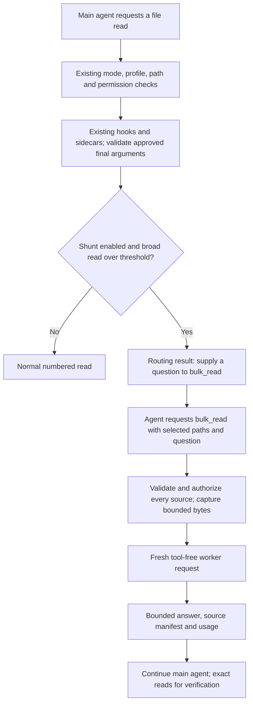

# Shunt for Litespeed

Status: research and implementation proposal. The feature is not implemented in Litespeed and no production settings have changed. The proposed option is off by default. Product decisions in the decision register remain open.

## Recommendation

Implement Shunt as an optional facility for large reads and predictable file generation, separate from the selected multi-model architecture. Preserve the public mechanism: a size gate redirects an untargeted read; an agent supplies a focused question; a fresh reader receives the source; only its answer returns to the requesting agent. A separate writer receives a specification and reference, generates a file, and returns a small receipt after a successful write.

Use Litespeed’s existing gateway connection, file permissions, history, usage accounting, and conversation UI. This is a recommended adaptation, not an identical Portal backend. Literal compatibility with the public plugin would instead require Portal, its authenticated CLI, and configured AiKA modes. Both approaches are possible; the transport choice needs a maintainer decision.

Do not reproduce upstream defects merely to preserve byte-for-byte behavior. In particular, a routing result must not be a permission denial, failed writes must not report success, generated content must pass through the normal mutation/history path, and the total worker usage must remain visible. The existing reader and writer model arrangements remain unchanged while the option is off.

## Evidence and reproducibility boundary

The supplied source is a Spotify engineering article published September 3, 2026, not an academic paper. It describes a Claude Code plugin, Shunt, backed by Portal AiKA modes. Its headline savings concern the main model’s context, and its public source is available. The private Java benchmark corpus and the author’s deployed mode configuration are not included. [Article](https://engineering.atspotify.com/2026/9/portal-by-spotify-cut-my-claude-code-token-usage-by-90).

| Component | Pinned material examined | What can be reproduced |
| --- | --- | --- |
| Article-linked fork | `sorantis/portal-ai-plugins@d39ced22231aa6e2147d6265fb92ba6123a2bbb0`, branch `add-shunt-claude` | The published client scripts, hooks, skills, and fixtures. |
| Current official plugin | `spotify/portal-ai-plugins@3c24ca30ff63e1f5bbad1c43fe5324daff579123`, plugin manifest version `0.2.0` | Exact local behavior at this revision, including its mistakes. This is the primary executable reference. |
| Portal CLI | npm `@spotify/portal-cli@0.4.3` | Published action transport and timeout behavior. It was inspected, not authenticated or run against Portal. |
| AiKA service | Public mode documentation and client protocol | Externally described contract. Private inference middleware, prompts added by the service, provider revisions, logging, and server internals are not reproduced. |
| Litespeed (then Speedrail) | `be152dbac93e574d611c2312eb86b3e3927f30e7` | Existing runner, tool, permission, provider, history, settings, and UI contracts. |

The fork and official plugin differ. The fork enables the experimental actions flag and assumes a 30-second CLI deadline. The official plugin removes that flag and sends `--timeout-seconds`, defaulting to 180 seconds. CLI 0.4.3 accepts that option; its action client defaults to 30 seconds only when no override is supplied. A hard 30-second service ceiling cannot be inferred from the article. [Fork transport](https://github.com/sorantis/portal-ai-plugins/blob/d39ced22231aa6e2147d6265fb92ba6123a2bbb0/plugins/shunt/scripts/lib/aika.sh), [official transport](https://github.com/spotify/portal-ai-plugins/blob/3c24ca30ff63e1f5bbad1c43fe5324daff579123/plugins/shunt/scripts/lib/aika.sh), [published CLI package](https://registry.npmjs.org/@spotify/portal-cli/-/portal-cli-0.4.3.tgz).

Shunt’s repository is Apache-2.0. The separately published Portal CLI package contains a commercial license notice. A native implementation should adapt the Apache-licensed plugin and avoid copying the CLI implementation. Reused prompts and source need their upstream attribution; the research bridge records that provenance. [Plugin license](https://github.com/spotify/portal-ai-plugins/blob/3c24ca30ff63e1f5bbad1c43fe5324daff579123/LICENSE), [CLI package containing LICENSE.md](https://registry.npmjs.org/@spotify/portal-cli/-/portal-cli-0.4.3.tgz).

“Identical” can therefore mean exact public client behavior or an equivalent workflow within Litespeed. It cannot honestly mean identical stochastic answers, private service execution, or a guaranteed reproduction of the article’s savings.

## Public execution contract

### Read routing

There is no learned router, speculative decoding, hidden-state transfer, classifier training, or model-weight change. The routing gate is a small shell program; the model then chooses the delegation arguments. This differs from Sidekick Fusion: the reader receives only the requested corpus and question and does not retain an agent conversation. [Hook registration](https://github.com/spotify/portal-ai-plugins/blob/3c24ca30ff63e1f5bbad1c43fe5324daff579123/plugins/shunt/hooks/hooks.json), [reader script](https://github.com/spotify/portal-ai-plugins/blob/3c24ca30ff63e1f5bbad1c43fe5324daff579123/plugins/shunt/scripts/bulk-read).

| Gate | Exact behavior at the pinned official revision |
| --- | --- |
| Threshold | `SHUNT_MIN_LINES`, default 350. Non-digit values fall back to 350. Zero is accepted. Files are gated only when the counted value is greater than the threshold. |
| Read input | Reads `tool_input.file_path`, `offset`, and `limit` from JSON stdin using `jq`. Any nonempty offset or limit value bypasses the gate, including zero or negative numbers. It does not validate a requested span. |
| Counting | `wc -l` counts newline bytes. A final unterminated line is not counted; CR-only text appears to have zero lines. Missing/non-regular paths pass to the original tool. |
| Read output | Exits zero with a top-level JSON `decision`; blocked results include a reason directing the agent to the reader skill. |
| Shell input | Only command strings beginning exactly with `cat `, `head `, `tail `, `less `, or `more ` are considered. Flags beginning with a hyphen are skipped; only the first remaining whitespace-separated argument is inspected. |
| Shell exemptions | Any `\|` or `>` anywhere in the command causes a pass. No parsing verifies that the pipe narrows output or that redirection removes output from the model’s view. |

These are observed algorithms, not guarantees that every large read is intercepted. A normal `head large.ts` is blocked despite printing only ten lines, while `head -n 5 large.ts` passes because `5` is mistaken for a filename. Quotes around paths containing spaces are not parsed correctly. [Read hook](https://github.com/spotify/portal-ai-plugins/blob/3c24ca30ff63e1f5bbad1c43fe5324daff579123/plugins/shunt/hooks/check-file-size), [shell hook](https://github.com/spotify/portal-ai-plugins/blob/3c24ca30ff63e1f5bbad1c43fe5324daff579123/plugins/shunt/hooks/check-bash-read), [local probe results](../research/shunt/results/upstream-audit.json).

Claude’s current hook reference documents the older top-level `block` result as deprecated but supported for PreToolUse. Litespeed uses a different payload and an exit-code contract. Translating only tool names is insufficient. [Claude hook contract](https://code.claude.com/docs/en/hooks#pretooluse-decision-control), [Litespeed hooks](../server/hooks.ts), [runner dispatch](../server/runner.ts).

### Reader

The `bulk-read` script requires a question and at least one path. It checks all paths before invocation. Each source is placed between `<file path="...">` and `</file>` delimiters, followed by the question. Paths and content are not XML-escaped; these are prompt delimiters, not an XML security boundary. Files are streamed to a temporary message file and removed on exit. There is no retrieval index, automatic chunking, previous-turn replay, or summary cache. A follow-up explicitly resends the files. [Reader implementation](https://github.com/spotify/portal-ai-plugins/blob/3c24ca30ff63e1f5bbad1c43fe5324daff579123/plugins/shunt/scripts/bulk-read).

The published reader prompt asks for concise, question-specific bullets with exact identifiers and nested details. The article’s example model is Gemini 2.5 Flash at temperature 0.2. The native research bridge uses that model route and the prompt from the current plugin README. This does not demonstrate the author’s hosted mode has exactly those settings today. [Mode setup examples](https://github.com/spotify/portal-ai-plugins/blob/3c24ca30ff63e1f5bbad1c43fe5324daff579123/plugins/shunt/README.md), [bridge prompt constants](../research/shunt/gateway-bridge.mjs).

Only returned text reaches the calling agent. The script’s stderr displays an approximate input count computed from message bytes divided by four; this is not provider-reported billing. Source bytes still reach the worker’s provider, and sending them again can incur more worker usage.

### Writer

`code-write` requires a specification and one reference file. It sends the specification followed by the reference content to a one-shot writer mode. Without a target it emits code to stdout. With a target it writes locally and emits a short receipt to stderr, keeping the generated source out of the calling agent’s tool result. The caller may subsequently read it for review. [Writer implementation](https://github.com/spotify/portal-ai-plugins/blob/3c24ca30ff63e1f5bbad1c43fe5324daff579123/plugins/shunt/scripts/code-write).

The writer prompt asks it to follow the reference’s conventions and emit code only. Cleanup deletes every line beginning with three backticks, rather than removing just one enclosing fence. A target is overwritten with shell redirection, without atomic commit, parent-directory creation, change tracking, a stale-content check, or a check of the write’s exit status. An empty cleaned result can still be written. These implementation properties matter when adapting the mechanism to an editor with undo and concurrent workers.

The writer has no enforcement hook. Its skill suggests predictable work, including tests and boilerplate, and relies on the main model to select it. It does not automatically reroute every `write_file` call. The skill calls for subsequent review; “code never enters driver context” describes the generation path, not a prohibition on verification. [Writer skill](https://github.com/spotify/portal-ai-plugins/blob/3c24ca30ff63e1f5bbad1c43fe5324daff579123/plugins/shunt/skills/code-writer/SKILL.md).

### Portal transport

The shared library selects an explicit `PORTAL_CLI_BIN`, an installed `portal-cli`, or `npx --yes @spotify/portal-cli`. One action invocation carries JSON with `message` and either `mode_name` or `mode_id`. Optional environment values select the Portal instance and pin the reader/writer IDs. Mode-name ownership precedence is delegated to the server; the shell library does not implement discovery itself.

The JSON is passed through argv. Defaults cap it at 400,000 bytes on macOS and 120,000 on Linux. This limit addresses command-line transport, not model context capacity. It is checked after request assembly. Stderr is captured separately to avoid corrupting stdout JSON. Nonzero status, invalid JSON, missing mode name, or absent text fails the call. A nonempty but wrong mode name or whitespace-only text can pass. There is no script-level retry or raw-file fallback. [Shared transport](https://github.com/spotify/portal-ai-plugins/blob/3c24ca30ff63e1f5bbad1c43fe5324daff579123/plugins/shunt/scripts/lib/aika.sh).

The public documentation describes mode instructions, optional model overrides, optional MCP tools, and optional processors. Processors can add inference calls. Neither public modes nor the term “ephemeral” establishes the provider’s retention settings. A native worker should use an explicit, tool-free request rather than attempting to emulate all of AiKA. [AiKA modes](https://backstage.spotify.com/docs/portal/core-features-and-plugins/aika/modes).

## Experiments and findings

Reproduction commands and raw evidence are in the [research harness](../research/shunt/README.md). The results distinguish upstream behavior, current Litespeed integration, and a live research prototype.

| Test layer | Result | What it establishes |
| --- | --- | --- |
| Unmodified upstream hook/transport suite | 51 passed, 0 failed | The published local regression suite passes at the pinned revision. Transport is stubbed. |
| Additional source probes | 32 assertions passed | The edge cases and defects below were reproduced. Passing assertions here describe behavior, not approval of it. |
| Existing Litespeed Runner and Store | Four isolated runs | Copying upstream JSON output permits the large read; translating to exit 2 prevents it but pauses the queue after the turn. A targeted read works normally. |
| Live gateway prototype | See measured results below | Real driver/worker calls, actual upstream read/write scripts, file output, objective answer checks, and recorded usage. Portal transport is replaced by a research bridge. |
| Production web/TUI integration | Not implemented or tested | Requires the design decisions and implementation described below. No claim of production parity is made. |

### Reproduced upstream gaps

The shell gate permits `cat file | cat`, leading whitespace, an `env` prefix, a large file after a small first argument, a quoted filename containing spaces, and a `>` in a comment. A stderr redirect also bypasses the gate even when a harness would include stderr in the returned output. The read gate accepts a full-size explicit limit. These are cost-routing gaps, not a security sandbox escape: the feature itself should never be treated as a permissions boundary.

A missing value for `--question` or `--spec` causes a loop because a failing shift leaves arguments unchanged. The probe cancelled each after 300 ms. A missing target directory prints a write error and still exits success; a fenced empty answer produces an empty file; a backtick-prefixed line inside a JavaScript template is removed. A stale mode without a name is rejected, but a different nonempty mode name is accepted. [32-case evidence](../research/shunt/results/upstream-audit.json).

The benchmark runner estimates tokens from character counts and suppresses invocation errors. A failed reader leaves an empty response that is scored as zero main-model tokens. The generated-code comparison weights output by a fixed factor of five and sets the delegated path to zero; that is neither a universal price model nor total-system token accounting. All benchmark requests deliberately failed in a stubbed reproduction, yet the benchmark exited zero and printed 100% savings. [Benchmark implementation](https://github.com/spotify/portal-ai-plugins/blob/3c24ca30ff63e1f5bbad1c43fe5324daff579123/plugins/shunt/evals/run.sh), [failed-request benchmark output](../research/shunt/results/upstream-failed-benchmark.txt).

The public TypeScript fixtures are synthetic, unlike the private Java corpus in the article. Some include invalid escaped operators and class members outside a class. They cannot substantiate compilation correctness of generated code. The file of three skill scenarios is descriptive JSON; `evals/run.sh` does not execute a real Claude session for those scenarios. [Public fixtures](https://github.com/spotify/portal-ai-plugins/tree/3c24ca30ff63e1f5bbad1c43fe5324daff579123/plugins/shunt/evals/fixtures), [skill scenario definitions](https://github.com/spotify/portal-ai-plugins/blob/3c24ca30ff63e1f5bbad1c43fe5324daff579123/plugins/shunt/evals/evals.json).

### Live comparison methodology

The driver is `claude-haiku-4-5-20251001`, the existing configured gateway default; the worker is `gemini/gemini-2.5-flash`, matching the article’s example model family. Both receive temperature 0.2 and a 4,096-output-token ceiling. These are experimental choices, not proposed product defaults. No model override was saved to a session.

The main agent runs a bounded eight-step tool loop. With Shunt off, it has read/write tools. With Shunt on, it also has reader/writer tools and a 350-line gate, including the original targeted-read exemption. The agent chooses calls and questions itself. Delegations run the unmodified upstream scripts with a gateway bridge replacing Portal’s action command. Each test uses fresh history; fixture contents are either synthetic or tracked Litespeed source. Generated modules are written in a temporary directory and loaded for exact-value verification.

The scorer checks factual values independently of surrounding Markdown. A separate `jsonOnly` field records extra prose. An initial smoke run used an overly strict JSON parser and identical prompts; its raw results are retained separately because formatting failures and gateway response reuse make it unsuitable as the main comparison. The measured runs use unique trial identifiers. Worker requests may still have cached prefixes or cached responses; cache reports are preserved, and these timings are not cold-provider benchmarks.

Measured tables are in [live results](../research/shunt/results/summary.md). The sample is too small and the tasks too narrow to establish general quality equivalence or a launch savings claim. In particular, a correct constant lookup does not test debugging or architectural judgment. Costs are not estimated from token counts: this gateway’s actual rate card and complete charge records were not established.

### Accounting rules for the feature

Record every driver and Shunt request in the existing usage ledger, including retries, failures with missing usage, and cancelled calls. Count cached tokens separately when reported. One final usage update should replace a previous cumulative update for the same request rather than double-count it. The turn total must include the Shunt requests even though their full input is absent from the parent’s context. [Current ledger](../server/usage.ts), [usage contracts](../shared/usage.ts).

For a paired experiment, main-model input reduction is `1 - on.driver.inputTokens / off.driver.inputTokens`. Total tokens are the sum of input and output for every participating model. Neither metric is monetary savings. A monetary comparison requires the actual routes’ input, output, and cache prices plus any provider charges. Future turns, repeated summaries, retries, verification reads, and cache effects can materially change the result.

## Integration design

### Tool execution

The recommended implementation adds native `bulk_read` and `code_write` tools and a small routing module. It does not add a fifth architecture or use the long-lived Sidecar extension to run inference. Sidecars allow argument modification/block/pass with a three-second timeout; they cannot supply a replacement tool result and do not represent a worker’s usage. Reusing them would obscure the intended semantics. [Sidecar protocol](../server/sidecars.ts), [sidecar bounds](../shared/sidecars.ts).



A routing result should be typed metadata on an otherwise handled tool call, with a compact instruction to use `bulk_read`. It must not set `run.blocked`, count as a permission failure, pause queues, or cause an infinite denial loop. Actual hook/permission denials remain final. The runner probe demonstrates why this distinction is necessary. [Runner probe](../research/shunt/results/runner-probe.json).

The gate should run only after existing restrictions have approved the final effective path. A Sidecar can change arguments, so classification must use its approved final arguments. The bulk reader must authorize each constituent path under the same underlying read rules, not just a blanket `bulk_read` rule. Multi-file external reads require a captured list of path approvals; the current `ToolPathAccess` represents one path and cannot simply be reused as a blanket grant.

Reuse safe file handling: protected credentials/state, symlinks, hard links, binary/non-UTF-8 files, and concurrent path changes retain their existing restrictions. Do not put data into a worker prompt before all required approvals. Implement a bounded complete source loader for delegation; `read_file` currently numbers and truncates output, and `readFile` caps bytes at 256 KiB. A truncated read must never be silently labeled a complete corpus. [File access and reading](../server/tools.ts).

For a native reader, preserve logical file boundaries with an escaped path and explicit byte/line metadata. Label source and summaries as untrusted data. A hash identifies the exact snapshot used; returned line references are advice, not edit authority. The main agent must read and match current source before modifying it. The worker has no tools, private environment access, conversation memory, or ability to recursively delegate.

For a writer, capture authorized reference snapshots and the target’s existing state before requesting generation. Verify nonempty complete output, remove only a single enclosing fence when applicable, enforce output bounds, and revalidate the target before committing. Perform the write through Litespeed’s existing mutation/history callbacks and workspace ownership handling. A changed target is a conflict, not permission to overwrite concurrent edits. Record the changed file and actual write result; only then return a receipt. Normal diff review and targeted verification remain available.

In Team/Expert Fusion, a strict driver cannot bypass the implementation/takeover rules by calling a new writer tool. The default recommendation scopes Shunt to the root agent for reading and permits its writer only where that agent already has mutation authority. Using Shunt inside delegated workers is a separate decision, and any such call must run in the worker’s actual isolated workspace with the parent’s accepted permissions. [Architecture enforcement](../server/runner.ts), [parallel workspaces](../server/parallel-workers.ts).

### Configuration and provider support

Proposed session value:

```ts
type ShuntSelection = {
  enabled: boolean;
  model: { providerId: string; model: string };
  minLines: number;
};
```

This minimal shape assumes one explicitly selected model for both reader and writer. Separate models, separate feature switches, fallback policy, and inheritance scope should only enter the schema if those choices are accepted. Absence means off for every existing session, imported session, and workspace preference. Enabling is an idle-only configuration change, revision checked and captured when a turn is accepted, matching architecture/planner behavior. No project file may silently enable an additional provider route.

Remember the selection per workspace for future sessions; existing sessions retain their own configuration. Session fork, export/import, queue acceptance, and provider removal must all have explicit rules. Recommended import behavior is to retain descriptive provenance but start Shunt off until a local model is chosen, following the existing conservative architecture import behavior. Removal of the chosen provider disables new invocations with a clear configuration message; it never chooses a substitute silently.

Litespeed’s provider abstraction currently does not expose temperature or per-call output limits. Add capability-aware support for the worker call, with 0.2 where supported. Do not send unsupported parameters to reasoning/subscription routes or silently represent a provider default as 0.2. For close model reproduction, validate the chosen gateway route and prompt contract. The first recommended scope is OpenAI-compatible gateways and native Anthropic; subscription-route support needs its own capability checks before being offered. [Provider options and adapters](../server/providers.ts).

Proposed operational defaults to review: threshold 350 logical lines; 180-second overall delegation deadline; no independent retry loop beyond the provider’s bounded transient retries, which share that deadline; at most one outstanding Shunt request per calling agent initially. Use the lesser of the configured byte ceiling and the selected model’s usable context after prompt/output reserve. A 256 KiB aggregate source ceiling is a conservative initial native bound; oversized calls return a split-request instruction, never a silent partial summary. Provider output limits must distinguish concise reader answers from file generation.

These bounds and line handling are intentional differences from the Bash plugin. They require approval along with the routing policy, rather than being advertised as exact upstream behavior.

### UI placement

Both clients should use **Models → Additional options → Shunt**, beneath architecture/model selection and alongside other optional model behavior. The first-run flow stays simple: choose gateway, architecture, and required models; Shunt remains off. An optional disclosure can link to the same configuration without making onboarding longer.

Proposed web control, using the existing model picker typography and switch:

```text
Additional options

Shunt                                           Off
Use an efficient model for large reads and predictable files.

When enabled:
Shunt model              [Choose a model          ▾]
Choose a fast, efficient model. Large files go to this provider.
Advanced                 [Read threshold and limits ▸]
```

The TUI uses the existing `/models` menu: a `Shunt: Off` row with the same description, then its model chooser and advanced menu when enabled. Enter edits, Escape cancels, and Save applies the captured revision. Both clients use shared descriptions and defaults. No new permanent composer badge or sidebar destination is needed. An optional `/shunt` shortcut can open that same panel if desired; it should not become a second configuration system. [Web picker](../client/src/ModelPicker.tsx), [terminal picker](../tui/models.tsx), [UI principles](ui-principles.md).

In the conversation, use the initiating tool call’s position:

```text
Shunt reader · Gemini 2.5 Flash · Reading 3 files…
  Which values control retry timing?
  [muted italic answer streams here]

Shunt writer · Gemini 2.5 Flash · Generating config…
  Wrote config/example.ts · Review changes
```

Each invocation has its own stable ID, caller, model, assignment, status, and source list. Show distinct rows for concurrent calls rather than a single shared “worker” status. These are one-shot tool operations, so they should be labeled Shunt reader/writer rather than Sidekick or Expert. The transcript expands inline once, stays anchored to its initiating round, and follows the existing live-tool grouping and scroll behavior. Raw worker source is not duplicated in the parent transcript; users inspect files or diffs through existing controls. Generated source shown in a human diff must remain separate from model context serialization.

Only the final turn shows usage totals; the existing breakdown can expose driver and Shunt separately. Avoid “saved 90%” or a running savings counter because the counterfactual was not observed. An actual timeout/error replaces the running status with a concrete recovery action. Switching the option while busy follows the existing idle-only model configuration rule.

### Files affected by implementation

| Area | Expected changes |
| --- | --- |
| Shared contract | `shared/shunt.ts` for defaults/validation/help; `shared/types.ts` for session selection and invocation metadata; `shared/usage.ts` for roles. |
| Execution | New `server/shunt.ts`; small runner integration for gate/tool dispatch, cancellation, approvals, and usage; safe complete-file loading and mutation reuse in `server/tools.ts`. |
| Configuration | `server/app.ts`, `server/store.ts`, and `server/workspace-preferences.ts`; session revisions, import/fork behavior, provider validation. |
| Providers | `server/providers.ts`; explicit supported temperature/output bounds with no changes to normal off-path requests. |
| Web | `ModelPicker.tsx`, selection/API state, conversation tool labels and operation presentation; existing spacing/type components. |
| TUI | `models.tsx`, controller/protocol configuration, `transcriptModel.ts` and inline operation rendering; same feature semantics. |
| Documentation | README Additional options entry; user guide `docs/shunt.md`; architecture/usage/permission notes where behavior needs explanation; upstream attribution. |

## Implementation and release tests

Implementation should proceed in four reviewable stages: shared contract and default-off compatibility; native reader and routing with accounting; writer and history/permission integration; both UIs and documentation. Each stage is accepted against the tests below. Do not label a mocked worker test as an end-to-end model quality result.

| Coverage | Required checks after implementation |
| --- | --- |
| Off path | Existing sessions/settings/imports default off; no new provider calls, prompts, schemas, reads, UI notices, or usage entries; current regression suite remains green. |
| Boundaries | 349/350/351 lines; final line without newline; CRLF and CR; explicit offset/limit, invalid values, huge single lines, empty files, binary files, payload/output bounds; no silent truncation. |
| Routing | Large read → route hint → worker answer → continuation; multiple consecutive calls; repeated broad-read attempts are bounded without poisoning successful turns; no queue pause or goal failure caused merely by routing. |
| Shell | Realistic targeted `head`/`tail`; piped and compound reads; quoted paths; redirection to stderr; external cwd; unknown commands retain ordinary shell permissions and are never claimed to be comprehensively intercepted. |
| Permissions | Plan-mode writer unavailable; explicit deny cannot be bypassed through bulk tools; protected files, external paths, symlink/hard-link swaps, profile tool restrictions, permission revocation and argument changes; deny before network transmission. |
| Writer | New file, replacement, missing directory, conflict during generation, partial/empty/fenced response, disk failure, cancellation before/after response, history recovery, undo/redo, diff evidence and no false success; preserve strict Fusion driver restrictions. |
| Models and accounting | Native Anthropic and configured OpenAI-compatible routes; unsupported temperature; tool-free worker, context overflow, 401/429/5xx, retries, abort and timeout, missing/cumulative usage, cached tokens and incomplete output. Every request belongs to its turn and operation exactly once. |
| State | Restart/resume, reload/SSE replay, export/import, fork, workspace preference isolation, missing provider, revision conflicts, queued input, steering and cancellation; no duplicate invocation after reconnect. |
| Architectures | Single, Sidekick, Team and Expert, each with off/on in both clients. Prove intended inheritance, absence of recursive delegation, per-worker attribution and correct isolated workspace. Add Planner/Plan coverage separately. |
| Web UI | Enable/save/reload/disable; model picker keyboard/focus; narrow/mobile width; streamed inline results; two concurrent workers; cancel/failure states; no extra modal to inspect results. |
| TUI | Real PTY setup/model selection, Save/Escape, resize, live reader/writer states, worker identity, scroll anchoring, permissions and cancellation. Screen assertions plus backend effects, not snapshots alone. |
| Live quality | Paired off/on runs on real small/large files, cross-file questions, test generation, exact editing, debugging, and a task where a plausible summary omits a critical detail. Use independent factual assertions and executable generated-code tests. Reject incorrect answers rather than scoring them as savings. |

For live release evaluation, pin provider routes, prompts, source revisions, model parameters, and trial inputs; run multiple independent trials with a defined spend cap. Record wall time, request counts, raw/cached input and output, factual coverage, verification outcome, and all failures. Keep mock fault injection separate from real-provider quality and keep warm/cold/cache observations explicit. A successful run demonstrates those cases, not that future model regressions are impossible.

## Decision register

These are material choices, not changes already made. Defaults explicitly requested are fixed: off initially, available in both clients, and documentation under Additional options.

| ID | Maintainer decision | Recommendation and tradeoff |
| --- | --- | --- |
| D1 | Literal Portal compatibility or native Litespeed implementation? | Native gateway integration. It avoids Portal login/CLI setup and uses current permissions and usage. It reproduces the workflow rather than the private service. Literal Portal can be a later adapter. |
| D2 | Reader and writer together, or reader first? | Deliver both before calling the feature complete, but stage the reader first. The writer remains agent-selected, like upstream; it does not silently reroute arbitrary edits. |
| D3 | One explicit Shunt model, existing worker reuse, or separate reader/writer models? | One explicit model for both. Suggest the current efficient Sidekick/Team worker, but require a selection when unavailable; never silently inherit a strong Expert or assume price from its name. Keep Gemini 2.5 Flash as the reproduction baseline, not a permanent hardcoded product default. |
| D4 | Copy all routing quirks, or preserve intent with corrected bounds and shell handling? | Correct the known bugs. Keep a configurable 350-line default, allow truly bounded targeted reads, and label shell interception as best effort. Require an explicit direct-read escape for broad reads needed for reasoning; do not pretend a supplied `limit: 2000` is necessarily targeted. |
| D5 | Which agents can use Shunt? | Root agent, including its Planner when selected, initially. Keep existing cheap workers and persistent Sidekicks unchanged; preserve strict-driver mutation limits. An all-agents option would need explicit inheritance and concurrent workload limits. |
| D6 | What happens after a worker failure or when exact full context is necessary? | Return a recoverable tool error/hint with no automatic full-file spill into the parent. Permit an explicit per-call direct read under ordinary file permissions, visible in the transcript; keep the feature on. Alternative: automatic raw fallback improves continuity but defeats predictable context control. |
| D7 | Persistence and configuration placement? | Per-session setting, remembered per workspace for new sessions; imports start off. Models → Additional options in web and TUI. Keep onboarding short; no permanent composer control. Confirm whether a `/shunt` shortcut is wanted. |
| D8 | Live presentation and stored evidence? | One inline reader/writer row per invocation, anchored to its caller, using existing compact styling. Store source paths/hashes, summary/receipt and actual usage; do not duplicate raw corpus in session history. Human diff viewing remains available without feeding it to the model. |
| D9 | Initial bounds and provider support? | Ten minutes without model/tool progress, matching the main harness; one call at a time per caller, 256 KiB aggregate source cap plus model context reserve; separately bounded reader/writer outputs. Start with existing API-key gateway/native Anthropic routes and validate subscription routes before enabling them. No automatic batch splitting, summary cache, extra inference retries, or model fallback in v1. |
| D10 | What is an acceptable quality/latency/spend tradeoff? | Require no factual or executable correctness regression on the agreed release corpus; report latency and total provider usage even where driver tokens improve. Do not put a numerical savings promise in the README. Set a budget and representative task set for the post-integration live matrix. |

## Proposed README wording after implementation

Place this between “Choose how models work together” and “Guides,” after the feature is implemented and verified:

> **Additional options**
>
> **Shunt** is an optional way to send large reads and predictable file generation to an efficient model while your main agent handles reasoning and review. It is off by default; enable it in **Models → Additional options** and choose its model. It can reduce the context sent to your main model, but adds worker usage and may increase latency. See the Shunt guide for routing, limits, and verification.

Until then, the branch’s README entry links to this proposal and explicitly identifies it as unshipped.
