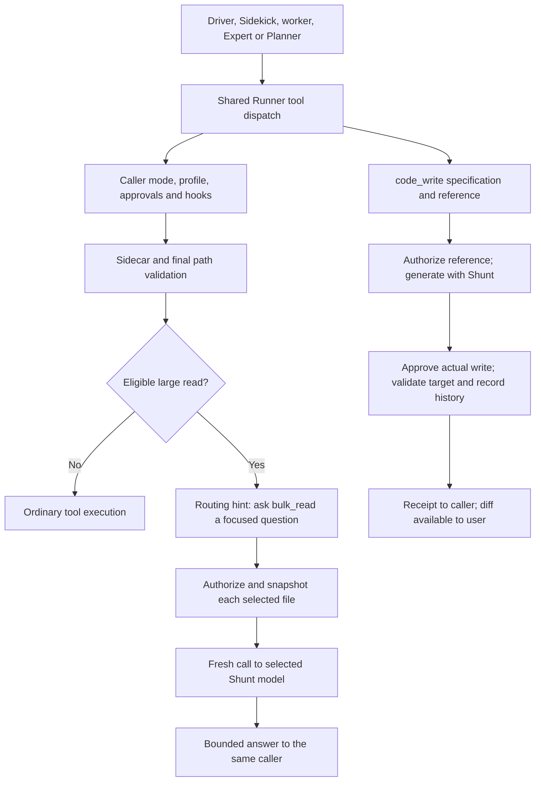

# Shunt integration proposal

Status: proposed, not implemented. Reviewed September 11, 2026 against the implementation at `5054c61`. This document turns the [upstream research and experiments](design-shunt.md) into a concrete integration plan for the current repository. The earlier research remains the source for upstream behavior; the native integration choices below are recommendations unless marked settled.

## Product contract

Shunt is an optional model service shared by all agents in a session. A user picks its model separately. Each agent can send a focused question and selected files to Shunt, get a concise answer, and continue its own work. For predictable generation, it can send a specification and reference and receive a file-write receipt. Shunt takes over those individual operations. Driver, Sidekick, worker, Expert, and Planner roles stay intact.

**Settled by the user:** default off; a dedicated Shunt model picker; support across Single, Sidekick Fusion, Team Fusion, and Expert Fusion; availability to their agents under existing permissions; web and TUI support; an option in onboarding; README placement under Additional options. A shared model selection means shared configuration, not shared conversation history. Users may explicitly choose the same model ID for another role.

**Recommended implementation:** native tools using the existing LiteLLM/provider connection. No additional Portal login, process, plugin installation, or credential store. Keep Shunt out of the architecture union and out of the persistent worker scheduler. It is a fresh, tool-free inference request owned by an existing tool call.

## What the repository already provides

| Current implementation | Consequence for Shunt |
| --- | --- |
| [`Runner.start`](../server/runner.ts) resolves routes, validates policy, and captures `RunPolicy` before accepting a message. `sidekick()` passes that policy into the same `loop()` used by the root. | Capture Shunt's route/provider once here. Integrate in the shared tool loop so root and child behavior agree. |
| [`Session`](../shared/types.ts), [`sessionSchema`](../server/app.ts), [`Store.updateSession`](../server/store.ts), and [`WorkspacePreferences`](../server/workspace-preferences.ts) implement model selection, revision checks, queue holds, and workspace defaults. | Add Shunt as a sibling of `architecture` and `planner`. Adding a field to the UI alone will lose it across several explicit serialization paths. |
| [`approve`](../server/runner.ts) routes worker approvals to the root and uses underlying actions for `verify` and the MCP capability gateway. | Use the same pattern for Shunt's constituent reads and final write. Existing grants and rules should continue to mean the same thing. |
| [`ToolPathAccess`](../server/tools.ts) binds one approved path; `mutateFile` checks concurrent changes and returns a diff. | Multi-file authorization and a receipt-only write result need deliberate changes. Neither is solved by calling the existing function blindly. |
| [`ParallelWorkers`](../server/parallel-workers.ts) owns isolated worker copies and conflict-checked publication. | A worker's Shunt request reads and writes that worker's copy. Ordinary worker completion publishes its patch. |
| [`streamCompletion`](../server/providers.ts) already carries the root LiteLLM session ID, retries, safe errors, caching, and a ten-minute no-progress timer. | Reuse this transport. It currently lacks configurable temperature/output caps, so those require adapter support and tests. |
| [`UsageLedger`](../server/usage.ts) records individual requests; [`RequestUsage`](../shared/usage.ts) attributes roles and phases. | Record Shunt separately while including it in the root turn/session totals. Do not manufacture a child session just for billing. |
| [`Onboarding`](../client/src/Onboarding.tsx) and [`Onboarding`](../tui/onboarding.tsx) share architecture descriptions from [`shared/setup.ts`](../shared/setup.ts). Both have quick and full paths. | Put the optional Shunt row on the final model screen in both paths; reuse their existing model choosers. |

## Onboarding and later configuration

Keep the current connection flow: enter gateway base URL and API key, connect, choose architecture and its models, start chatting. On the final screen, show this compact section beneath the architecture models in both quick and full setup:

```text
Additional options

Shunt · Optional                                  Off
Use a separate efficient model for large reads and routine code.

When enabled:
Shunt model                    [Choose a model          ▾]
Choose a fast model with enough context for your files.
Selected files go to this model's provider. Adds model calls.

                                      [Start chatting]
```

No fourth mandatory setup page. Shunt stays visibly available in the quick flow, rather than being hidden behind Customize setup. Leaving it off requires no additional input. Turning it on reveals its picker; starting requires an explicit selection. Switching architectures preserves this selection. Cancelling the picker leaves a visible incomplete draft or lets the user switch Shunt off; it must not silently choose the driver or worker.

Reuse web `ModelField` and TUI `ModelChooser`, including search, manual gateway model IDs, loading/error states, keyboard navigation, focus restoration, and terminal-safe text. Reuse the connected provider, but do not preselect a model. A gateway URL change clears or revalidates any now-invalid Shunt route just as the existing setup handles driver/worker routes.

Later, put the same control in **Models → Additional options → Shunt**, after the architecture and Planner sections. `/setup` revisits onboarding; `/models` changes the setting. No new command, permanent composer badge, sidebar destination, or logo is needed. Advanced read limits belong here, not in first-run setup. Shunt's guidance and validation messages should come from shared code.

Keep a local draft until Save. Invalid or stale configuration stays open with its error. Follow the existing API flow for saving the session and workspace preference, and only mark setup complete after successful persistence. A failure to remember workspace defaults must be retryable without silently losing the saved session selection.

## Configuration and lifecycle

Proposed shared contract, with server defaults for omitted limits:

```ts
type ShuntSelection =
  | { enabled: false; model?: ModelRoute; minLines?: number }
  | { enabled: true; model: ModelRoute; minLines?: number };

// Session.shunt?: ShuntSelection
// PATCH: undefined = unchanged; null = clear; enabled:false = retain draft route.
```

Absence means off, including existing installations. Remember explicit choices per workspace for new sessions; resuming an existing session uses that session's choice. A local fork can retain its setting, but imported sessions start off until the user chooses a local route. Imported/exported display metadata must not confer authority or point at another session's live operations.

Update the API's create, update, import, and workspace-preference schemas; Store's explicit change detection; and all web `Selection` reconstruction paths in `Composer.tsx` and `App.tsx`. TUI configuration uses the same API and `Session`, but its draft and onboarding save paths also need the field. Disabled preferences should preserve a chosen model without requiring that provider to remain connected. An enabled missing provider fails preflight with “Choose a Shunt model or turn Shunt off”; no silent substitute or fallback to a worker.

Changing Shunt is an idle-only, revision-checked configuration change. Queued messages follow the existing explicit review/resume rule. Capture a cloned Shunt provider and selection before accepting the next turn; children inherit that captured configuration. Include the Shunt configuration and provider identity in Sidekick context compatibility, so a gateway or credential change cannot reuse an incompatible persistent context. Never resolve the route again from live settings midway through a call.

Do not let repository instructions, imported profiles, or model-generated configuration enable a new route. Existing profile tool restrictions remain effective: a profile with `read_file` can use the derived reader; it needs `write_file` for the writer. This avoids making users update every profile just to retain the same file permissions.

## Runtime flow and code placement



Add small `shared/shunt.ts`, `server/shunt.ts`, and `server/shunt-files.ts` modules. The shared module owns selection, constants, tool metadata, and presentation types. The server modules own prompt construction, bounded provider calls, and source snapshots. `Runner` owns policy, tool dispatch, events, and cancellation. File primitives stay in `tools.ts` or a factored helper used by its existing read/write paths.

Do not implement Shunt as `sidekick()`, `delegate`, `task`, or a recursive `Runner.start()`. Those create agent lifecycles, persistent transcripts or invocation budgets that a one-shot read does not need. Shunt calls should not consume the existing eight-worker-assignment allowance. No new step ceiling is proposed.

When off, omit Shunt tools and instructions entirely and avoid source-size probes. When on, advertise stable native `bulk_read` and `code_write` schemas according to the caller's underlying tool permissions. Keep routing instructions session-constant for cache stability. The parent model never receives the Shunt provider's response as an assistant message: it receives the ordinary tool result for the original invocation.

### Reads

For a broad `read_file`, put the routing gate after normal approval, PreToolUse hooks, sidecar rewriting/reapproval, and final path validation, before the normal read serializes file content. Count logical lines with bounded I/O and stop once the threshold is established. A successfully handled routing hint needs explicit metadata such as `disposition: 'routed'`; it is not a failed or denied read.

This distinction has practical consequences. The current runner marks denials as blocked work and may pause queues. It also treats completed `read_file` calls as evidence that a model read a file. Update both outcome handling and [`computeReceipts`](../server/receipts.ts) so a routing hint does neither. Keep existing repeat guards; repeated ignored routing hints must eventually produce a useful recovery explanation without an unbounded loop.

`bulk_read({ question, paths })` authorizes all paths, snapshots each complete file within bounds, and makes a fresh tool-free request. The prompt contains only the reader instructions, question, source manifest, and selected source bytes. It does not copy the caller's history, memories, credentials, MCP tools, or other workers' files. Return concise answers with source paths/hashes; the caller still uses exact current reads for edits and difficult verification.

Recommend a 350-line threshold, matching the upstream default. An explicit requested range of at most 350 lines remains direct. Merely supplying `limit: 2000` or an offset should not bypass the gate. A larger direct read needs an explicit reason, such as debugging that requires exact context; normal file bounds and permissions still apply. This corrects an upstream bypass and is a design choice for approval.

Keep shell interception limited to commands that can actually be parsed as file reads. The existing [`shellInspection`](../server/shell-inspection.ts) parser is for a conservative command set; it is not a general shell parser. Do not copy upstream whitespace splitting or call arbitrary piped commands “targeted.” Broader shell execution remains subject to existing Bash policy. Do not automatically route `web_fetch`, MCP results, attachments, grep output, or compaction through Shunt in this first version: they have different source and authority contracts.

### Generation

Use `code_write({ spec, reference, target? })`, preserving the upstream specification, reference file, and optional target contract. With a target, the caller gets a receipt; without one, bounded generated text returns to the caller and necessarily enters its context. Explain this difference in the tool description. Map `target` to the underlying `write_file.path` for permissions, takeover checks and mutation handling.

Before inference, check the caller's mode/profile, explicit target deny rules, reference access, and source/output budgets. Capture the target's original state. Generate in memory without tools. With a target, submit the actual proposed write to the existing approval and hook/sidecar flow, showing the generated diff when an approval is needed. The permission prompt is for writing that file, not a second general “allow Shunt” permission. Approval for a reference read and approval for a write remain distinct when both are required.

After any sidecar modification, reapprove/revalidate the effective write. Recheck the target against the pre-generation snapshot so a file changed while the model was working is a conflict. The current `mutateFile` takes its baseline only when called; simply invoking it after generation would miss that earlier race. Factor an expected-state check and receipt-only return option into the common mutation path. Preserve `prepareChange`/`commitChange`, external-file notices, cancellation-after-write recording, and worker actor attribution.

Keep generated content and human diff data out of the caller's `ToolCall.args`, ordinary tool result, and automatic compaction input. `providerMessages()` serializes tool arguments directly, so adding generated code there defeats the feature. Store actual changes through history and display metadata; return a short path/hash/result receipt. Mark `code_write` changes in verification receipts and failure recovery by target path, so an unchanged tool name cannot accidentally bypass the normal “changed after last check” or unresolved-write logic.

Do not write incomplete, empty, or truncated output, or strip every Markdown fence line as the upstream script does. A transport success alone is not a successful file write. Verification remains the calling agent's responsibility.

## Permissions, architectures, and concurrent work

Use underlying `read_file`/`write_file` subjects for rules, remembered grants, profile limits, and hooks. A broad grant for `bulk_read` must never override a denied file. The reader needs a list of captured path approvals, not today's single `approvedPaths` entry; revalidate the whole source set before transmission. Protected files and symlink/hard-link handling keep their current behavior.

Factor an authorized-action helper from the existing dispatch sequence, rather than maintaining a second permission engine in `shunt.ts`. Run hooks and sidecars on the constituent real reads and final write. A routed original read and a later explicit bulk read are separate operations; a real explicit ask rule can therefore ask again. Ordinary in-workspace reads remain prompt-free, and remembered grants remain scoped to the actual tool/target. Enabling Shunt does not change Ask first or Allow all tools semantics.

| Caller | Available Shunt work | Workspace and ownership |
| --- | --- | --- |
| Single agent | Reader and writer in Build; reader in Plan | Current session workspace and root turn history. |
| Sidekick Fusion driver | Reader/writer within its normal authority | Root workspace. |
| Persistent Sidekick | Reader/writer | Its current workspace, root approval owner and history attribution; each Shunt request has fresh context. |
| Team/Expert driver | Reader; writer only within an already permitted exact-path takeover | Preserve takeover path checks, edit allowance and required driver verification. |
| Team worker or Expert | Reader/writer | The worker's private workspace, then existing conflict-checked patch publication. |
| Planner or read-only researcher | Reader only | Its captured read-only policy; no expansion of its tools or hooks. |

All callers share the selected Shunt route, not source buffers or answers. A result returns to the originating agent, not automatically to the driver. Its root-visible activity identifies that caller. Do not make the entire session wait behind a new global Shunt mutex. Recommend one active Shunt operation per caller, allowing existing parallel workers to call it concurrently. Caller workspace ownership must be acquired before a write, with the existing visible, cancellable wait. Normal root-turn ownership remains unchanged.

Stop and steering abort the provider request through the caller's signal; stopping a worker aborts its Shunt call. Partial generation cannot publish after cancellation. Already committed effects must still be recorded. Genuine provider chunks update both the request timer and the owning worker's progress, preventing the worker watchdog from cancelling an active Shunt request. Waiting for approvals pauses the owning worker timer; repeatedly rendering “working” must not count as progress.

## Context, caching, memory, and accounting

Keep existing compaction for each agent. Shunt reduces what enters that agent's context; it does not replace compaction or erase earlier stored transcripts. Root history and historical Sidekick transcripts can still contain files read before Shunt was enabled. A changed configuration retires incompatible active Sidekick context through the existing compatibility check; subsequent eligible reads use the new route.

Use the model catalog/context-budget helpers for Shunt's own input and output reserve. A corpus too large for the selected route is an actionable tool error, never silently truncated and summarized as complete. Prompt/source order should be stable so provider caching can help, while preserving independent requests and correct caller workspace. Do not claim follow-ups are free or add a cross-session summary cache in this version.

Use `streamCompletion` with no tools and the root LiteLLM session ID. Add optional capability-aware temperature and output limits without changing any off-path request body. Validate API-key gateway and native Anthropic routes first; subscription-route support is a separate compatibility decision. Refuse unexpected tool requests and incomplete outputs even if a provider returns them without advertised tools.

Extend `RequestUsage` with a Shunt role and reader/writer phases plus originating operation and caller metadata. Keep a child caller's existing invocation ID intact; use a separate field for the Shunt operation ID. Record each retry as a new request and cumulative usage as an update to its request. The existing ledger then supplies one root-turn total including all agents and Shunt. Show “Shunt · model” in the final expandable breakdown, with caller details available. Missing cost remains unknown.

Memory stays at its current default and scope. Do not give Shunt memory tools or duplicate memory retrieval for each invocation. A source summary is untrusted evidence, not automatically a durable memory. Full corpus bytes should exist only in bounded execution buffers and the actual provider request, not a hidden child conversation stored locally.

## Runtime UI and recovery

Use ordinary tool events anchored to `(callerSessionId, messageId, toolCallId)`, with typed Shunt display metadata. Reuse the root event journal and existing worker transcript subscriptions. Do not create a `DelegationSummary` or an extra worker card for Shunt; that structure requires a child session and would distort worker counts, cancellation, and persistent-context behavior.

Show the operation where the agent invoked it:

```text
Worker 2 · Implement retry handling
  Shunt reader · selected-model · Reading 3 files…
    What are the existing retry rules?
    [concise answer streams here in muted italic text]

  Shunt writer · selected-model · Generating retry.test.ts…
  Shunt writer · selected-model · Wrote retry.test.ts · Review changes
```

Each worker retains its own card. Shunt rows live inside that worker's existing transcript; driver calls live directly in the main timeline. The current worker previews flatten tool calls to one-line labels, so both web and TUI previews must render Shunt's bounded answer metadata too, not just add tool names. No extra Inspect or modal action should be necessary to see live progress and the concise answer. Assignment, source list and diff can remain optional details.

Follow the current compact spacing, live tool grouping, collapse-on-text/completion rules, and scroll anchoring. A Shunt activity replaces the caller's generic thinking indicator. Batch streaming UI updates, while recording genuine progress independently, so each token does not rewrite the full transcript. Do not expose hidden reasoning or raw corpus as a transcript preview.

Represent waiting, source loading, model response, approval, workspace wait, writing, completion and failure through existing tool status plus display phase. The tool's bounded output and metadata are durable before publishing completion. Reconnect reconstructs the same operation; it does not start a new request. On restart, integrate with existing incomplete-tool/history recovery and mark unfinished Shunt work interrupted. Never retry a model call or file write simply because the UI reconnects.

Show the concrete safe error: for example, “Shunt reader · model: gateway rejected the API key (401).” A recoverable read failure can lead to another question, targeted read, explicit broad-read escape, or user configuration change. Recommend no automatic model substitution or full-file fallback. A single Shunt error should not permanently poison the queue after the caller successfully recovers; update the existing Single-mode error handling narrowly for these recoverable outcomes. Actual denials and unrecorded mutations retain their current blocking behavior.

## Proposed bounds and release scope

These numbers are recommendations for approval and verification, not existing settings:

| Choice | Proposed initial behavior |
| --- | --- |
| Read routing | More than 350 logical lines; bounded targeted reads remain direct; explicit reason for broad direct reads. |
| Input | 256 KiB aggregate sources per invocation, further limited by the selected model's usable context. Bounded source counting/loading; no automatic splitting. |
| Reader output | Up to 2,048 output tokens and 8 KiB of answer text; incomplete/oversized results are clearly unsuccessful. |
| Writer output | Up to 8,192 output tokens and 256 KiB, also subject to normal write limits; never commit partial output. |
| Timing | Ten minutes without model progress; no total running-time or model-step ceiling. Existing bounded transient retries only. |
| Concurrency | One invocation per caller at a time; different architecture agents can call concurrently under existing worker scheduling. |
| Sampling | Upstream's temperature 0.2 where the selected route supports it; otherwise use its provider default and identify the difference in reproduction results. |
| First scope | Local-file reader and writer, using API-key gateways/native Anthropic; no automatic routing of web/MCP/attachments, no retrieval index, no summary cache. |

The public upstream hook/scripts would be adapted with their Apache-2.0 attribution. Avoid copying the separately licensed Portal CLI. Delivery should include reader and writer before labeling the complete option shipped; implement and verify the reader first to keep the integration reviewable.

## Implementation sequence and verification

1. **Shared configuration and setup.** Add selection/schema/state propagation, provider preflight and capture, workspace preferences, idle revision handling, and onboarding/model-picker controls in both clients. Keep the feature unavailable in a release until the execution path exists.
2. **Reader and policy composition.** Add source authorization/snapshot helpers, routing metadata, tool availability for all roles, bounded provider calls, usage, live rows, cancellation and recovery. Confirm unchanged off-path behavior before adding generation.
3. **Writer and effects.** Add pre-generation target snapshots, approval of actual generated writes, hook/sidecar handling, expected-state mutation checks, receipt-only output, evidence, history and worker integration.
4. **Paired end-to-end evaluation and docs.** Exercise real UI and model flows, then replace the README's proposed label, add `docs/shunt.md`, and update architecture, permission, context and usage guides together.

The release gates should include:

| Test layer | What must be demonstrated |
| --- | --- |
| Configuration/API | Missing field is off; enabled route required; disabled route retained; quick/full setup, save/cancel, reload/restart, cross-client persistence, provider removal/change, fork/import and stale revisions. Queues cannot silently adopt changed settings. |
| Real runner with deterministic providers | All architecture/caller roles on/off, no recursive agent creation, correct source/answer isolation, permission denial before transmission, multiple external paths, hooks/sidecars that redirect paths, protected files and path races. Sentinel source text reaches only the selected Shunt route unless explicitly read directly. |
| Effects/recovery | Target changed while generating, empty/truncated output, disk failures, approval cancellation, steering, timeout, crash before/after mutation, Undo/Redo, parallel patch conflicts and post-write verification receipts. |
| Context/cost | No off-path prompt/schema change; no raw generated code in provider history or compaction; repeated summaries, cached input, retries and missing reports counted correctly under the root LiteLLM session ID. |
| Browser and native TUI | Quick and full onboarding; all four architectures on/off; model selection, inline worker results, simultaneous workers, narrow windows, keyboard and scrolling, no duplicate indicators or mandatory Inspect, reconnect and clear errors. Browser tests plus owned real PTY tests, not snapshots alone. |
| Packaged macOS install/update | Fresh bundled installation completes setup with Shunt off or on; both clients persist the selection; updating preserves sessions/preferences and introduces no Portal or extra runtime dependency. |
| Live model comparison | Real gateway runs with Shunt off/on using the same source/task/model arrangement, executable acceptance tests and factual assertions; separately record cold and warm-cache runs, total usage, latency, retries, failure recovery and actual costs where reported. |

Use the existing mocked-server runner fixtures and isolated stores for deterministic cases; add `tests/shunt-runner.test.ts`, focused file/provider tests and browser Shunt scenarios. Extend `tests/e2e/setup.spec.ts`, worker presentation tests, and `scripts/test-tui-interactions.mjs`. Include at least two workers whose private workspaces contain different contents at the same relative path, and a run with the maximum simultaneous workers already allowed by the architecture budget.

For the live comparison, propose 12 task fixtures: four large/cross-file reads, two targeted-read controls, two generation tasks, two edits needing exact reads, and two debugging cases where summaries can omit critical facts. Run every fixture with each of the four architectures, on and off, three repetitions: **288 root runs**, with cache condition recorded rather than inferred. Exercise every architecture's setup/streaming path with a real model in both clients separately. Agree on a spend ceiling before this matrix; stop at that ceiling and report incomplete coverage. Do not claim quality parity from fewer completed cases or price savings from token counts alone.

Baseline verification on the reviewed implementation: **68 tests passed across six suites** (`workspace-setup`, `fusion-accounting`, `sidekick-runner`, `external-access-runner`, `sidecars-runner`, `cache-runner`). These validate existing integration behavior with isolated fixtures and stub providers. They do not test an implemented Shunt feature. Earlier live prototype results are in the research report; they are not production UI end-to-end evidence.

## Decisions for the maintainer

The settled product requirements above do not need another confirmation. These are the remaining proposed choices:

1. **Native integration and initial scope:** use the existing gateway/API-key providers, ship reader and writer together, and defer Portal compatibility, subscription routes and automatic web/MCP routing. This best fits today's setup and tool contracts.
2. **Routing and recovery:** use the corrected 350-line gate with an explicit broad-read escape, and show recoverable errors instead of silently falling back to raw files or another model. This preserves control over context while allowing exact reads when needed.
3. **Defaults and persistence:** use the bounds table, one shared Shunt selection per session remembered per workspace, import off, an optional row on the existing final onboarding screen, and later configuration in Models. Per-model reasoning follows the existing provider/model preference system; no additional Shunt reasoning control in onboarding.
4. **Evaluation budget:** approve or resize the 288-run matrix and set a maximum gateway spend. Model pricing is gateway-specific, so no dollar estimate is invented here. Release requires passing deterministic/UI gates and reviewing actual quality, latency and spend results.

Implementation should begin after review of these choices. This proposal adds no runtime behavior and makes no production savings guarantee.
