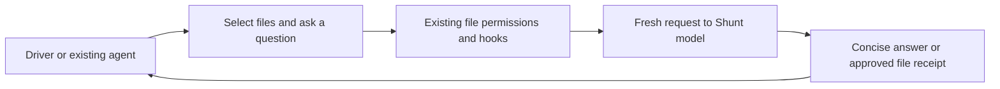

# Shunt

Shunt sends large reads and routine generation to a separate model, keeping bulky source text out of the calling agent’s context. It is optional and off by default.

## Turn it on

In the web model selector or TUI `/models`, open **Advanced settings → Shunt** and choose a model. The same entry appears on the final onboarding screen, collapsed in the web UI. Choose a fast, efficient model through your existing LiteLLM gateway or another connected API provider. There is no Portal account or additional installation.

Shunt never automatically inherits the Driver, Sidekick, Worker, Expert or Planner model. You may deliberately choose the same model ID for two roles; their requests and contexts remain separate. OpenAI-compatible gateways and native Anthropic are supported. ChatGPT subscription providers are not selectable for Shunt.

The setting applies to the session and is remembered for new sessions across workspaces. Existing sessions retain their own configuration. Local forks retain it; imports start with Shunt off. Changes require an idle session and the current configuration revision. Queued messages follow the usual review/resume rules. A missing enabled provider requires choosing a new route or turning Shunt off; it never silently substitutes another model.

## How it works



Shunt works with Single, Sidekick Fusion, Team Fusion and Expert Fusion. The Planner and read-only researchers can use its reader. Each agent keeps its reasoning, exact edits, coordination and verification responsibilities. Shunt creates no worker session, consumes no worker launch slot, and has no tools of its own.

**Reading.** A broad `read_file` request for more than 350 logical lines returns a routing hint rather than the source. The caller can then use:

```json
{"question":"How are failed requests retried?","paths":["server/providers.ts","server/retry.ts"]}
```

The `bulk_read` tool sends complete selected UTF-8 files to the chosen Shunt model. Only its bounded answer returns to the caller. Every question starts fresh; follow-up questions must select their sources again. There is no persistent retrieval index.

Small explicit ranges remain direct. For debugging, precise edits, or recovery, the agent can supply `direct_reason` on `read_file`. This is an agent decision, not an additional human approval step. Normal read limits and permissions still apply. An offset alone does not bypass the gate. A routing hint is not a permission denial and does not count as evidence that the agent read the source.

**Writing.** `code_write` takes a specification, an existing reference **file path**, and an optional target:

```json
{"spec":"Generate the retry tests following this test file’s conventions.","reference":"tests/cache.test.ts","target":"tests/retry.test.ts"}
```

Shunt generates the complete file in memory. With a target, the generated content passes through the usual write approval, hooks, sidecars, conflict checks and history. The caller receives a small path/size/hash receipt. Generated code is available for human review and Undo, but is not copied into the caller’s tool arguments or result. The caller must inspect and test the actual file. Without a target, the tool returns bounded code text directly into the caller’s context.

The writer is selected by the agent, not automatically imposed on every edit. Tiny writes can be cheaper directly; ambiguous changes and debugging usually need the original reasoning model.

## Permissions and recovery

Each source is authorized as an ordinary `read_file`. The final mutation is authorized as an ordinary `write_file`, including the actual proposed content. Existing remembered grants, explicit deny/ask rules, external-path checks, protected files and profile restrictions apply. Hooks and sidecars run on those underlying file actions. Sidecar redirects require authorization again. An intercepted writer cannot silently change its target.

Plan mode and researchers remain read-only. A profile needs `read_file` for the reader and both `read_file` and `write_file` for the writer. Team/Expert drivers still need their normal bounded takeover before writing. Shunt operates in the caller’s actual workspace, including each parallel worker’s private copy; the existing integration checks handle publishing those changes. An intervening target edit causes an error instead of an overwrite. External writes retain the existing limitation that workspace Undo does not cover them.

Cancellation stops the request. New steering is checked before each source and before a generated write. The existing provider watchdog allows ten minutes without model progress; there is no new total runtime or model-step ceiling. Empty, malformed, oversized, incomplete, or tool-request responses fail without writing a partial file. Errors appear inline. No automatic fallback sends full source to another model, and a real permission denial remains final.

## Context and usage

| Bound | Default |
| --- | --- |
| Broad-read threshold | More than 350 logical lines |
| Source selection | Up to 32 files, 256 KiB combined |
| Question/specification | Up to 8,000 characters |
| Reader output | 2,048 tokens and 8 KiB text |
| Writer output | 8,192 tokens and 256 KiB text |
| Context fit | Estimated request plus output reserve must fit the selected model’s window/input limit |

These are Litespeed bounds, not claimed Claude Code defaults. The existing model catalog, context overrides, direct-read limits, pruning and compaction remain active. Shunt is an additional way to avoid large tool results before they enter a conversation. It does not replace compaction or memory. Provider-default sampling is retained; Litespeed does not currently force the example upstream temperature of 0.2.

Each request carries the root LiteLLM session ID. The usage ledger records Shunt separately, with its originating operation and worker identity, and includes reported usage in the root turn total. Retry attempts remain separately counted. Unreported usage and cost stay unknown. Raw source buffers are not saved in conversation history; file manifests contain paths, hashes and sizes. Generated changes remain in ordinary file history for review and Undo. Selected source content still goes to the chosen provider and may be subject to its logging/retention settings.

## Results and provenance

Spotify reported roughly 90% less main-model context on its large-read examples. That is not a promise of 90% less total usage, latency or cost. Shunt adds model requests, targeted reads may already be small, and cache behavior changes the cost comparison. [Spotify’s article](https://engineering.atspotify.com/2026/9/portal-by-spotify-cut-my-claude-code-token-usage-by-90).

The [native evaluation report](../research/shunt/results/native-summary.md) records the paired pilot and its limitations. Regression coverage exercises actual Runner dispatch, file permissions, cancellation, generation, Undo, private worker copies, configuration, browser streaming and native terminal interactions.

This is a native adaptation of Spotify’s published Apache-2.0 Shunt mechanism, not a copy of the separately licensed Portal service. It preserves fresh reader/writer requests and the read gate while using Litespeed’s provider transport and permission system. See [upstream research](design-shunt.md), the [approved integration proposal](shunt-integration.md), and [third-party notices](../THIRD_PARTY_NOTICES.md).
